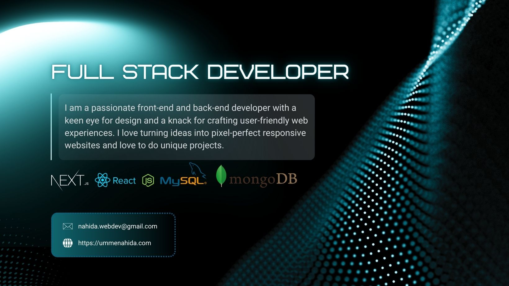

<h1 align="center">Hi 👋, I'm <strong>Umme Nahida</strong></h1>

<p align="center">
  Frontend & MERN Stack Developer • Problem Solver • UI-focused Builder
</p> 

<p align="center">
  I’m a passionate <strong>Frontend & MERN Stack Developer</strong> who loves building clean, responsive, and user-focused web applications.  
  I enjoy working with modern JavaScript frameworks, writing maintainable code, and turning ideas into real products.
</p>

<p align="center">
  Outside of coding, I explore new tools, improve my skills through hands-on projects, and enjoy learning how things work under the hood.
</p>

<br />

<div align="center">
  <a href="https://github.com/UmmeNahida" target="_blank">
    
  </a>
  <a href="https://linkedin.com/in/UmmeNahida" target="_blank">
    
  </a>
  <a href="https://facebook.com/UmmeNahida.dev" target="_blank">
    
  </a>
  <a href="https://ummenahida.com" target="_blank">
    
  </a>
</div>

<br />



<h2 align="center">👩‍💻 About Me</h2>

- 🌱 Currently learning **PostgreSQL & Docker**
- 👨‍💻 All projects available at **[ummenahida.com](https://ummenahida.com)**
- 📫 Reach me at **nahida.webdev@gmail.com**
- 💬 Ask me about **JavaScript, React, Node.js**
- ⚡ Fun fact: I enjoy creating bugs and learn something new every time.🙂

<h2 align="center">⚙️ Skills & Tech Stack</h2>

<details>
<summary align="center"><b>📂 ~/Umme_Nahida — click to expand</b></summary>

```bash
📂 ~/Umme_Nahida
├── 💻 languages
│   ├── javascript
│   ├── typescript
│   └── shell_scripts
│
├── 🚀 backend
│   ├── node.js
│   ├── express.js
│   ├── bun
│   └── mvc_architecture
│
├── 🎨 frontend
│   ├── react
│   ├── next.js
│   ├── shadcn-ui
│   ├── tailwind
│   ├── mui
│   ├── progressive_web_apps
│   └── service_workers
│
├── 🗄️ databases
│   ├── postgresql
│   ├── mongodb
│   └── redis
│
└── 🔧 tools_&_platforms
    ├── git | github | gitlab
    ├── postman
    ├── docker
    ├── vs_code
    └── figma
```

</details>

<br />

<div align="center">


</div>

<h2 align="center">📦 Featured Projects</h2>

<p align="center">
  A selection of tools, libraries, and experiments I’ve built while solving real problems.
</p>

<table>
  <tr>
    <td align="center" width="33%">
      <h3>🔧 <a href="https://github.com/UmmeNahida/event-activities-client">Event Management</a></h3>
      <p>A full-stack event management platform that connects users with local activities, enabling event discovery, participation, reviews, payments, and admin moderation.</p>
      
      
    </td>
    <td align="center" width="33%">
      <h3> <a href="https://github.com/UmmeNahida/next-level-project6-frontend">Ride Management</a></h3>
      <p>A powerfull modern Ride Management Applications</p>
      
      
    </td>
    <td align="center" width="33%">
      <h3> <a href="https://github.com/UmmeNahida/next-level-project6-frontend">Health Care</a></h3>
      <p>A powerfull modern Health Care Applications</p>
      
      
    </td>
  </tr>
</table>

<div align="center">
  <a href="https://ummenahida.com/#work">
    
  </a>
</div>
