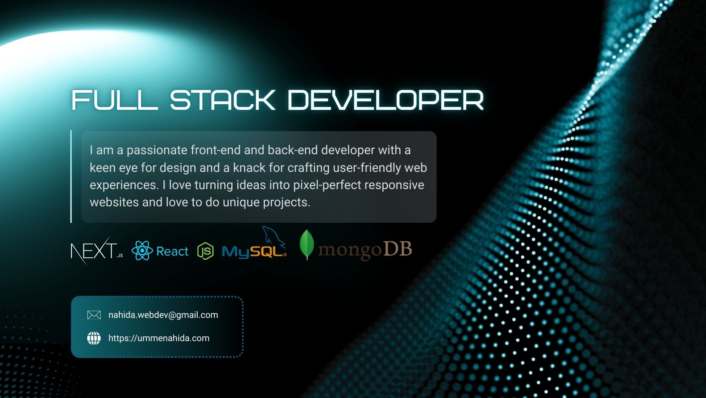

  

 
 

  
  

  
  
  
  

 

  
  

 
 

<h3 align="center">⚙️ Skills & Tech Stack</h3>

  🔗 Full skillset: <a href="https://ummenahida.com/skills">ummenahida.com/skills</a>

 

 
 

<h3 align="center">📦 Featured Projects</h3>

  A collection of full-stack web apps I've built — from idea to deployment.

  
  

  
    

 

  

 
 

  

